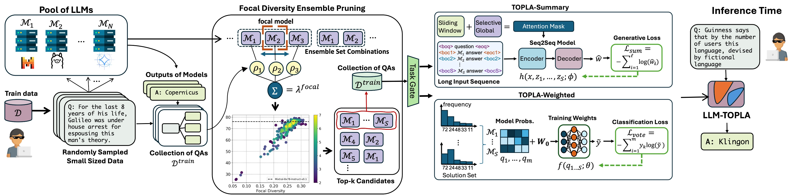

# LLM-TOPLA: Efficient LLM Ensemble by Maximising Diversity



## Install
```
$ pip install requirements.txt
```

## Datasets
an anonymous link will be given
## Basemodel Outputs
an anonymous link will be given
## Run

To train LLM-TOPLA-Weighted on GSM8k or MMLU outputs of phi-2, Mixtral, and LLama

```
$ python topla_weighted.py --task_name gsm8k --model_ids 237 
```

To train LLM-TOPLA-Summary on GSM8k or SearchQA

```
$ python topla_open_ended.py --task_name search_qa --model_ids 237 
```

To train LLM-TOPLA-Summary on XSUM

```
$ python topla_summary.py --task_name xsum --model_ids 0123 
```
